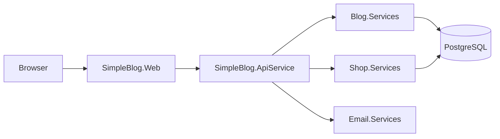

# Project Structure

> ## Document Metadata
> 
> ### ✅ Required
> **Title:** Project Structure  
> **Description:** Detailed description of code organization, folder structure and responsibilities of each project in SimpleBlog solution  
> **Audience:** developer  
> **Topic:** development  
> **Last Update:** 2026-01-17
>
> ### 📌 Recommended
> **Parent Document:** [README.md](./README.md)  
> **Difficulty:** intermediate  
> **Estimated Time:** 20 min  
> **Version:** 1.0.0  
> **Status:** approved
>
> ### 🏷️ Optional
> **Related Docs:** [getting-started.md](./getting-started.md), [aspire-development.md](./aspire-development.md)  
> **Tags:** `architecture`, `structure`, `organization`, `aspire`

---

## 📋 Overview

SimpleBlog uses .NET Aspire architecture with division into services and shared libraries. This document describes project organization and responsibilities of each component.

---

## 📂 Main Structure

```
SimpleBlog/
├── SimpleBlog.sln                     # Solution file
├── docker-compose.yml                 # PostgreSQL + pgAdmin
├── start.ps1                          # Skrypt uruchamiający
├── stop.ps1                           # Skrypt zatrzymujący
│
├── docs/                              # Dokumentacja
│   ├── development/                   # Dev docs
│   ├── deployment/                    # Deployment docs
│   └── technical/                     # Technical docs
│
├── SimpleBlog.AppHost/               # 🎯 Aspire Orchestrator
├── SimpleBlog.ServiceDefaults/       # 🔧 Shared configuration
├── SimpleBlog.ApiService/            # 🌐 REST API
├── SimpleBlog.Web/                   # 💻 Frontend web app
│
├── SimpleBlog.Common/                # 📦 Shared abstractions
├── SimpleBlog.Common.Api/            # 📦 Shared API utilities
│
├── SimpleBlog.Blog.Services/         # 📝 Blog domain services
├── SimpleBlog.Shop.Services/         # 🛒 Shop domain services
├── SimpleBlog.Email.Services/        # 📧 Email services
│
└── SimpleBlog.Tests/                 # 🧪 Unit tests
```

---

## 🎯 Main Projects

### SimpleBlog.AppHost
**Type:** Aspire App Host  
**Responsibility:** Orchestration of all services

```csharp
// Program.cs - definicja topologii
var builder = DistributedApplication.CreateBuilder(args);

var postgres = builder.AddPostgres("postgres")
    .WithDataVolume("simpleblog-postgres-data")
    .AddDatabase("blogdb");

var apiService = builder.AddProject<Projects.SimpleBlog_ApiService>("apiservice")
    .WithReference(postgres);

var webfrontend = builder.AddProject<Projects.SimpleBlog_Web>("webfrontend")
    .WithExternalHttpEndpoints()
    .WithReference(apiService);
```

**Key Files:**
- `Program.cs` - Services and dependencies definition
- `appsettings.json` - Aspire configuration

---

### SimpleBlog.ApiService
**Type:** ASP.NET Core Web API  
**Responsibility:** REST API backend

```
SimpleBlog.ApiService/
├── Program.cs                        # Main entry point, startup configuration
├── Constants.cs                      # Application constants
├── DatabaseSeeder.cs                 # Database seeding logic
│
├── Configuration/                    # Configuration extensions
│   ├── AuthorizationConfiguration.cs
│   ├── CorsConfiguration.cs
│   ├── DatabaseConfiguration.cs
│   └── JwtConfiguration.cs
│
├── Data/
│   ├── ApplicationDbContext.cs      # Main DB context
│   └── Migrations/                  # EF Core migrations
│
├── Endpoints/                       # Minimal API endpoints
│   ├── AboutMeEndpoints.cs
│   ├── AuthEndpoints.cs
│   ├── OrderEndpoints.cs
│   ├── PostEndpoints.cs
│   └── ProductEndpoints.cs
│
├── Identity/                        # Auth & identity
│   ├── IdentityUserRepository.cs
│   └── UserDto.cs
│
├── Middleware/                      # Custom middleware
│   └── RequestLoggingMiddleware.cs
│
└── Seeding/                         # Seed data providers
    ├── AboutMeSeedData.cs
    ├── PostSeedData.cs
    ├── ProductSeedData.cs
    └── UserSeedData.cs
```

**Key Concepts:**
- **Minimal APIs:** Endpoints instead of Controllers
- **Dependency Injection:** All services through DI
- **Configuration extensions:** Configuration separation (CORS, JWT, DB)

---

### SimpleBlog.Web
**Type:** ASP.NET Core + React SPA  
**Responsibility:** Frontend web application

```
SimpleBlog.Web/
├── Program.cs                        # Backend proxy
├── appsettings.json                 # Configuration
│
└── client/                          # React frontend
    ├── package.json
    ├── vite.config.ts               # Vite configuration
    ├── tsconfig.json                # TypeScript config
    │
    ├── public/                      # Static assets
    │
    └── src/
        ├── main.tsx                 # Entry point
        ├── App.tsx                  # Root component
        │
        ├── components/              # React components
        │   ├── AboutMe.tsx
        │   ├── Login.tsx
        │   ├── PostList.tsx
        │   ├── ProductList.tsx
        │   └── ...
        │
        ├── hooks/                   # Custom hooks
        │   ├── useAuth.ts
        │   └── usePosts.ts
        │
        ├── services/                # API services
        │   └── api.ts
        │
        └── types/                   # TypeScript types
            └── index.ts
```

**Architecture:**
- Backend: ASP.NET Core proxy to API
- Frontend: React 18 + TypeScript + Vite
- Routing: React Router
- State: React Context + Hooks

---

## 📦 Shared Libraries

### SimpleBlog.Common
**Responsibility:** Shared abstractions and interfaces

```
SimpleBlog.Common/
├── Interfaces/                      # Repository interfaces
│   ├── IAboutMeRepository.cs
│   ├── IPostRepository.cs
│   ├── IProductRepository.cs
│   └── IOrderRepository.cs
│
├── Models/                          # Domain models (DTOs)
│   ├── AboutMeDto.cs
│   ├── PostDto.cs
│   ├── ProductDto.cs
│   └── OrderDto.cs
│
├── Specifications/                  # Specification pattern
│   ├── ISpecification.cs
│   └── BaseSpecification.cs
│
├── Validators/                      # FluentValidation validators
│   ├── PostValidator.cs
│   ├── ProductValidator.cs
│   └── OrderValidator.cs
│
├── Exceptions/                      # Custom exceptions
│   ├── NotFoundException.cs
│   └── ValidationException.cs
│
├── Extensions/                      # Extension methods
│   └── StringExtensions.cs
│
└── Logging/                         # Logging utilities
    ├── IOperationLogger.cs
    └── OperationLogger.cs
```

**Design patterns:**
- **Repository Pattern:** `IPostRepository`, `IProductRepository`
- **Specification Pattern:** Reusable query logic
- **DTO Pattern:** Data transfer objects for API

---

### SimpleBlog.Common.Api
**Odpowiedzialność:** Współdzielone utilities dla API

```
SimpleBlog.Common.Api/
├── Configuration/
│   ├── EndpointConfiguration.cs     # Shared endpoint paths
│   └── ConfigurationExtensions.cs   # Helper extensions
│
└── Extensions/
    └── ConfigurationExtensions.cs   # Load shared appsettings
```

**Koncepcja:**
Centralizacja konfiguracji endpointów przez hierarchię plików:
1. `appsettings.shared.json` - Base configuration
2. `appsettings.shared.Development.json` - Dev overrides
3. Environment variables - Runtime overrides

---

## 🏗️ projekty domenowe

### SimpleBlog.Blog.Services
**Odpowiedzialność:** Blog domain (Posts, Comments, About Me)

```
SimpleBlog.Blog.Services/
├── BlogDbContext.cs                 # Blog DB context
├── Entities.cs                      # Blog entities (Post, Comment)
│
├── Data/
│   └── Migrations/                  # Blog migrations
│
├── EfPostRepository.cs              # Post repository implementation
├── EfAboutMeRepository.cs           # About Me repository
│
└── Specifications/                  # Blog specifications
    └── PostSpecifications.cs
```

**Entities:**
- `Post` - Blog post with title, content, image
- `Comment` - Comment on post (future)
- `AboutMe` - About page content

---

### SimpleBlog.Shop.Services
**Responsibility:** E-commerce domain (Products, Orders)

```
SimpleBlog.Shop.Services/
├── ShopDbContext.cs                 # Shop DB context
├── Entities.cs                      # Shop entities
│
├── Data/
│   └── Migrations/                  # Shop migrations
│
├── EfProductRepository.cs           # Product repository
├── EfOrderRepository.cs             # Order repository
│
└── Specifications/                  # Shop specifications
    └── ProductSpecifications.cs
```

**Entities:**
- `Product` - Product with name, price, stock
- `Order` - Customer order
- `OrderItem` - Line items in order

---

### SimpleBlog.Email.Services
**Responsibility:** Email sending functionality

```
SimpleBlog.Email.Services/
└── SmtpEmailService.cs              # SMTP email implementation
```

**Interface:** `IEmailService` from `SimpleBlog.Common`

---

## 🧪 Tests

### SimpleBlog.Tests
**Responsibility:** Unit and integration tests

```
SimpleBlog.Tests/
├── AboutMeRepositoryTests.cs
├── BlogRepositoryTests.cs
├── ShopRepositoryTests.cs
├── UserRepositoryTests.cs
├── SpecificationTests.cs
├── ValidationTests.cs
│
├── NoOpOperationLogger.cs           # Test helper
└── README.md                         # Test documentation
```

**Framework:** xUnit + EF Core InMemory

---

## 🔧 Configuration Files

### Shared Configuration

```
appsettings.shared.json              # Base endpoint configuration
appsettings.shared.Development.json  # Dev-specific overrides
appsettings.shared.Production.json   # Prod-specific overrides
```

**Example:** `appsettings.shared.json`
```json
{
  "Endpoints": {
    "Health": "/health",
    "Auth": {
      "Login": "/api/auth/login",
      "Register": "/api/auth/register"
    },
    "Posts": {
      "Base": "/api/posts",
      "Details": "/api/posts/{id}"
    }
  }
}
```

### docker configuration

```
docker-compose.yml                   # Development PostgreSQL + pgAdmin
docker-compose.dev.yml               # Alternative dev setup
```

---

## 📊 przepływ danych



**Service Discovery:** Aspire automatically manages URLs between services

---

## 🔗 Related Documents

- [getting-started.md](./getting-started.md) - Environment setup
- [aspire-development.md](./aspire-development.md) - Working with Aspire
- [../technical/architecture-overview.md](../technical/architecture-overview.md) - Architecture details

---

## 💡 Naming Conventions

- **Projects:** `SimpleBlog.[Feature/Layer]`
- **Configuration files:** `appsettings.{purpose}.{environment}.json`
- **Endpoints:** `/api/{resource}/{id?}/{action?}`
- **Components:** `PascalCase.tsx`
- **Hooks:** `use{Feature}.ts`
