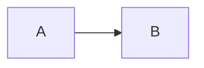
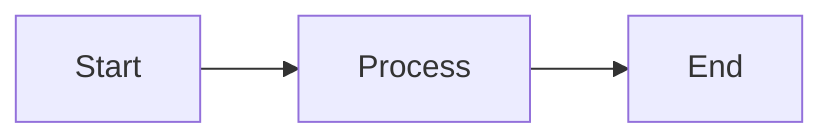
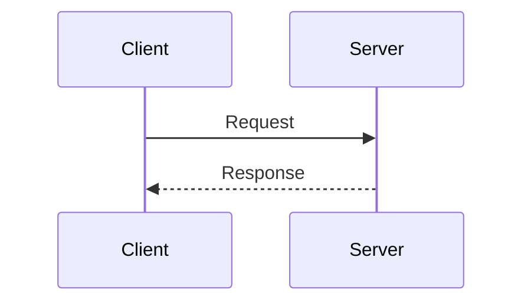
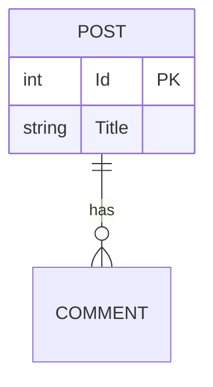
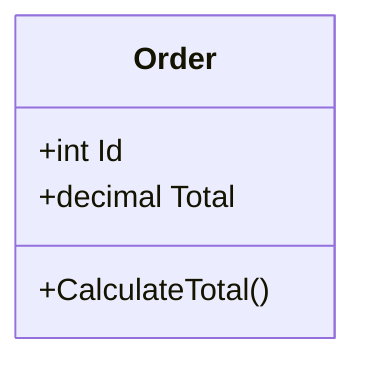

# Documentation Standards

> ## Document Metadata
> 
> ### ✅ Required
> **Title:** Documentation Standards  
> **Description:** Official standards and guidelines for SimpleBlog project documentation  
> **Audience:** contributor, developer, technical writer  
> **Topic:** documentation  
> **Last Update:** 2026-01-17
>
> ### 📌 Recommended
> **Parent Document:** [README.md](./README.md)  
> **Difficulty:** beginner  
> **Estimated Time:** 10 min  
> **Version:** 1.0.0  
> **Status:** approved
>
> ### 🏷️ Optional
> **Tags:** `standards`, `guidelines`, `documentation`, `best-practices`

---

## 📋 Overview

This document defines the official standards and guidelines for creating, formatting, and maintaining documentation in the SimpleBlog project. Following these standards ensures consistency, quality, and ease of maintenance across all documentation.

---

## 🎯 Five Pillars of Documentation

SimpleBlog documentation is based on five key principles:

### 1. 🔄 Consistency

**Goal:** Ensure a uniform user experience when reading documentation

**Practices:**
- Use lowercase letters in file names (e.g., `getting-started.md`, not `Getting-Started.md`)
- Apply uniform metadata structure in all documents
- Maintain consistent terminology (e.g., always "endpoint", not sometimes "endpoint" sometimes "API route")
- Use the same date format: `YYYY-MM-DD` (e.g., 2026-01-17)
- Use emoji consistently: 🚀 for quick start, 📚 for table of contents, ⚙️ for configuration

**Examples:**
```markdown
# Good: Consistent naming
- getting-started.md
- project-structure.md
- api-endpoints.md

# Avoid: Inconsistent naming
- Getting-Started.md
- projectStructure.md
- API_Endpoints.md
```

---

### 2. ✨ Quality

**Goal:** Provide valuable, accurate, and useful information

**Practices:**
- Write clear, concise descriptions without unnecessary words
- Every code example must be tested and working
- Update documentation immediately after code changes
- Conduct code review for documentation (just like for code)
- Use proper English grammar and spelling
- Avoid slang and jargon without explanation

**Examples:**
```markdown
# Good: Clear, specific description
Run the application using the `dotnet run` command. 
The application will start on port 5000.

# Avoid: Unclear, vague description
After starting the application it may be available on different ports
depending on configuration and environment.
```

---

### 3. 🔧 Maintainability

**Goal:** Documentation easy to update and manage over time

**Practices:**
- Use relative links between documents (e.g., `./getting-started.md`)
- Mark deprecated documents clearly in metadata
- Maintain changelog for significant changes
- One document = one topic (avoid "all-in-one" documents)
- Avoid duplication - link to existing documents
- Use include/reference instead of copying content

**Examples:**
```markdown
# Good: Relative links
See the [getting started guide](./getting-started.md) for details.

# Avoid: Absolute links or hardcoded URLs
See https://github.com/SimpleBlog/docs/getting-started.md
```

---

### 4. ♿ Accessibility

**Goal:** Documentation accessible to everyone, regardless of knowledge level

**Practices:**
- Use emoji for better section readability (but don't overdo it)
- Every diagram/image must have text description
- Hierarchical header structure (h1 → h2 → h3)
- Difficulty level helps find appropriate document
- Estimated time allows planning learning
- Prerequisites section clearly defines requirements

**Examples:**
```markdown
# Good: Hierarchical structure with emoji
## 🚀 Quick Start
### Step 1: Installation
### Step 2: Configuration

# Good: Diagram description

**Explanation:** Data flow from component A to B
```

---

### 5. 🎨 Visual Communication

**Goal:** Use visual elements for better understanding

**Practices:**
- Use Mermaid diagrams for architecture, flow, relationships
- Highlight important information through blockquotes
- Format code with appropriate languages (syntax highlighting)
- Use tables for comparisons, parameters, configuration
- Emoji to mark information type (⚠️ Warning, ✅ Note, 💡 Tip)

**Examples:**
```markdown
# Good: Highlighting important information
> ⚠️ **Warning:** Never commit secrets to the repository!

> ✅ **Note:** This endpoint requires JWT authentication

> 💡 **Tip:** Use `--watch` flag for auto-reload

# Good: Table for parameters
| Parameter | Type | Required | Description |
|-----------|------|----------|-------------|
| username | string | Yes | Username |
| password | string | Yes | Password (min 8 characters) |
```

---

## 📑 Metadata Structure

### Required Fields

Every document **must** contain:

```markdown
> ## Document Metadata
> 
> ### ✅ Required
> **Title:** [Full document name]
> **Description:** [Brief description of document purpose in 2-3 sentences]
> **Audience:** [developer | devops | architect | end-user | contributor]
> **Topic:** [development | deployment | technical | infrastructure | testing]
> **Last Update:** [YYYY-MM-DD]
```

**Field Explanations:**
- **Title:** Full, descriptive name (may differ from file name)
- **Description:** 2-3 sentences explaining purpose and content
- **Audience:** Who is the target reader
- **Topic:** Main document topic (facilitates categorization)
- **Last Update:** Date of last modification (ISO format: YYYY-MM-DD)

---

### Recommended Fields

Strongly recommended (especially for complex documents):

```markdown
> ### 📌 Recommended
> **Parent Document:** [../parent-doc.md](../parent-doc.md)
> **Difficulty:** [beginner | intermediate | advanced]
> **Estimated Time:** [X min | X hours]
> **Version:** [x.y.z]
> **Status:** [draft | review | approved | deprecated]
```

**Field Explanations:**
- **Parent Document:** Link to parent document (hierarchy)
- **Difficulty:** Reader difficulty level
  - `beginner` - Basic knowledge, quick start
  - `intermediate` - Requires project familiarity
  - `advanced` - For advanced users
- **Estimated Time:** How long to read/execute
- **Version:** Document version (semantic versioning)
- **Status:** Current document status
  - `draft` - Work in progress
  - `review` - Waiting for review
  - `approved` - Approved, ready
  - `deprecated` - Outdated, needs update/removal

---

### Optional Fields

Add when it makes sense for the context:

```markdown
> ### 🏷️ Optional
> **Prerequisites:** [List of prerequisites]
> **Related Docs:** [doc1.md](./doc1.md), [doc2.md](./doc2.md)
> **Tags:** `tag1`, `tag2`, `tag3`
```

**Field Explanations:**
- **Prerequisites:** Brief list of what you need to know/have before reading
- **Related Docs:** Links to related documents
- **Tags:** Keywords for searching (use backticks)

---

## 📝 File Naming

### Conventions

```markdown
# ✅ Good: Lowercase, hyphens
getting-started.md
project-structure.md
api-endpoints.md
database-migrations.md

# ❌ Avoid: Uppercase, spaces, underscores
Getting-Started.md
Project Structure.md
API_Endpoints.md
Database_Migrations.md
```

### Name Categories

- **Guides:** `{action}-guide.md` (e.g., `deployment-guide.md`)
- **Overviews:** `{topic}-overview.md` (e.g., `architecture-overview.md`)
- **References:** `{topic}-reference.md` (e.g., `api-reference.md`)
- **Tutorials:** `{topic}-tutorial.md` (e.g., `docker-tutorial.md`)
- **ADRs:** `adr-{number}-{title}.md` (e.g., `adr-001-aspire-adoption.md`)

---

## 🎨 Text Formatting

### Headers

```markdown
# h1 - Only at the beginning of document (title)
## h2 - Main sections
### h3 - Subsections
#### h4 - Details (rarely used)
```

**Rules:**
- H1 only once per document
- Use emoji at the beginning of H2 for better readability
- Hierarchy: don't skip levels (h2 → h4 is wrong)

---

### Code Blocks

Always specify language:

```markdown
# ✅ Good: With language
```csharp
public class MyClass { }
```

```bash
dotnet run
```

```json
{ "key": "value" }
```

# ❌ Avoid: Without language
```
code without syntax highlighting
```
```

**Available Languages:**
- `csharp`, `javascript`, `typescript`, `bash`, `powershell`
- `json`, `yaml`, `xml`, `sql`
- `html`, `css`, `markdown`

---

### Lists

```markdown
# Ordered (numbered)
1. First step
2. Second step
3. Third step

# Unordered (bullets)
- Item 1
- Item 2
  - Subpoint A
  - Subpoint B

# Checklists
- [ ] Task to do
- [x] Completed task
```

---

### Tables

```markdown
| Column 1 | Column 2 | Column 3 |
|----------|----------|----------|
| Value 1  | Value 2  | Value 3  |
| Value 4  | Value 5  | Value 6  |

# With alignment
| Left | Center | Right |
|:-----|:------:|------:|
| L1   |  C1    |    R1 |
```

**When to Use Tables:**
- Configuration parameters
- Option/tool comparisons
- Changelogs
- Reference materials

---

### Blockquotes

```markdown
> ⚠️ **Warning:** Critical warning about issues
> ✅ **Note:** Additional information helpful for understanding
> 💡 **Tip:** Optimization tip or best practice
> 🔒 **Security:** Important security information
```

---

### Links

```markdown
# Relative links (preferred)
[Getting Started](./getting-started.md)
[Parent README](../README.md)

# Links with anchor
[Specific Section](./doc.md#section-name)

# External links
[Official Docs](https://example.com)

# Reference style (for multiple uses)
[link text][reference]

[reference]: https://example.com
```

---

## 📊 Mermaid Diagrams

### Diagram Types

```markdown
# Flow diagram


# Sequence diagram


# ER diagram (entities)


# Class diagram

```

**Rules:**
- Always add text explanation after diagram
- Use simple, readable names
- Don't overcomplicate - better several simple diagrams than one complex

---

## ✅ Pre-Publication Checklist

Before marking document as `Status: approved`:

### Metadata
- [ ] All required fields filled
- [ ] "Last Update" date current
- [ ] Audience and Topic correctly defined
- [ ] Status matches reality

### Content
- [ ] Title clearly describes topic
- [ ] Overview explains document purpose
- [ ] All sections complete
- [ ] Code examples tested and working
- [ ] Comments in code explain what happens

### Formatting
- [ ] Hierarchical headers (h1 → h2 → h3)
- [ ] Code with appropriate languages
- [ ] Tables properly formatted
- [ ] Diagrams have text descriptions

### Links and References
- [ ] All links work (relative paths)
- [ ] Related docs link to existing files
- [ ] External links lead to current resources

### Quality
- [ ] No typos or grammar errors
- [ ] Consistent style and terminology
- [ ] Troubleshooting contains real problems
- [ ] Document reviewed by another person

---

## 🔄 Documentation Update Process

### When to Update

Documentation must be updated **always when:**
- You add new functionality
- You change API endpoints
- You modify configuration
- You fix a bug that affects documented behavior
- You add new dependencies or requirements

### Update Workflow

```
1. Code change
   ↓
2. Identify documents to update
   ↓
3. Update content
   ↓
4. Change "Last Update" date
   ↓
5. Status → "review" (if significant changes)
   ↓
6. Code review (code + documentation together)
   ↓
7. Status → "approved"
   ↓
8. Merge to main branch
```

---

## 📚 Examples

### Minimal Example (Required Fields Only)

```markdown
# Quick Setup Guide

> ## Document Metadata
> 
> ### ✅ Required
> **Title:** Quick Setup Guide
> **Description:** Quickly run the application in 5 minutes
> **Audience:** developer
> **Topic:** development
> **Last Update:** 2026-01-17

## 📋 Overview

This guide will help you run SimpleBlog in less than 5 minutes.

[... rest of content ...]
```

---

### Full Example (All Fields)

```markdown
# Advanced Deployment Strategies

> ## Document Metadata
> 
> ### ✅ Required
> **Title:** Advanced Deployment Strategies
> **Description:** Advanced techniques for deploying applications to production with high availability and blue-green deployments
> **Audience:** devops, architect
> **Topic:** deployment
> **Last Update:** 2026-01-17
>
> ### 📌 Recommended
> **Parent Document:** [deployment/README.md](./README.md)
> **Difficulty:** advanced
> **Estimated Time:** 45 min
> **Version:** 2.1.0
> **Status:** approved
>
> ### 🏷️ Optional
> **Prerequisites:** Basic knowledge of Docker, Kubernetes, and CI/CD pipelines
> **Related Docs:** [docker-deployment.md](./docker-deployment.md), [kubernetes-guide.md](./kubernetes-guide.md)
> **Tags:** `deployment`, `kubernetes`, `high-availability`, `blue-green`

## 📋 Overview

This document describes advanced strategies for deploying SimpleBlog...

[... rest of content ...]
```

---

## 🔗 Resources

### Templates
- [documentation-template.md](./documentation-template.md) - Complete document template

### Existing Documentation
- [development/README.md](./development/README.md) - Example of well-organized documentation
- [architecture-overview.md](./technical/architecture-overview.md) - Example of technical document

### External Resources
- [Markdown Guide](https://www.markdownguide.org/) - Complete Markdown guide
- [Mermaid Documentation](https://mermaid.js.org/) - Mermaid diagram documentation
- [Microsoft Writing Style Guide](https://learn.microsoft.com/style-guide/) - Documentation writing style

---

## 📝 Changelog

| Date | Version | Changes |
|------|---------|---------|
| 2026-01-17 | 1.0.0 | First version of documentation standards |
