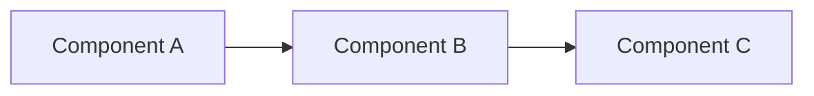

# [Document Title]

> ## Document Metadata
> 
> ### ✅ Required
> **Title:** [Full document name]  
> **Description:** [Brief description of document purpose in 2-3 sentences]  
> **Audience:** [developer | devops | architect | end-user | contributor]  
> **Topic:** [development | deployment | technical | infrastructure | testing]  
> **Last Update:** [YYYY-MM-DD]
>
> ### 📌 Recommended
> **Parent Document:** [../parent-doc.md](../parent-doc.md)  
> **Difficulty:** [beginner | intermediate | advanced]  
> **Estimated Time:** [X min | X hours]  
> **Version:** [x.y.z]  
> **Status:** [draft | review | approved | deprecated]
>
> ### 🏷️ Optional
> **Prerequisites:** [List of prerequisites]  
> **Related Docs:** [doc1.md](./doc1.md), [doc2.md](./doc2.md)  
> **Tags:** `tag1`, `tag2`, `tag3`

---

## 📋 Overview

[Extended description of document purpose. What will the reader find in this document?]

---

## 🎯 Document Purpose

[Detailed description of the goal and scope of the document. Answer the questions:]
- What will be described?
- What problems does it solve?
- What will the reader be able to do after reading?

---

## ✅ Prerequisites

[List of all requirements before starting:]

- [ ] [Requirement 1] - [Link to installation/documentation]
- [ ] [Requirement 2] - [Version, configuration]
- [ ] [Requirement 3] - [Additional information]

**Verify Installation:**
```bash
# Command to verify
example-command --version
```

---

## 🚀 Quick Start

[Minimal path to run/deploy - step by step:]

### Step 1: [Step Name]

```bash
# Describe what the command does
example-command --flag value
```

**Expected Result:**
```
[Example output]
```

### Step 2: [Step Name]

```bash
# Another command with explanation
another-command
```

---

## ⚙️ Configuration

[Detailed configuration with explanations:]

### [Configuration Section Name]

```json
{
  "Setting1": "value1",  // Description of setting 1
  "Setting2": "value2"   // Description of setting 2
}
```

**Parameters:**

| Parameter | Type | Required | Default Value | Description |
|-----------|------|----------|---------------|-------------|
| Setting1 | string | Yes | - | Detailed parameter description |
| Setting2 | int | No | 100 | Description with usage example |

---

## 💻 Code Examples

[Practical examples with comments:]

### Example 1: [Example Name]

```csharp
// Good: Best practice with explanation why
public class GoodExample
{
    private readonly IService _service;
    
    public GoodExample(IService service)
    {
        _service = service;
    }
}
```

```csharp
// Avoid: Bad practice with explanation why to avoid it
public class BadExample
{
    public static IService Service { get; set; }
}
```

---

## 📊 Architecture/Diagram

[If applicable, add Mermaid diagrams or architecture descriptions:]



**Explanation:**
- **Component A:** [Description of role and responsibilities]
- **Component B:** [Description of communication and data]
- **Component C:** [Description of result]

---

## 📂 File Structure

[If applicable, show folder structure:]

```
project/
├── folder1/
│   ├── file1.cs           # File description
│   └── file2.cs           # File description
├── folder2/
│   └── subfolder/
│       └── file3.cs       # File description
└── config.json            # Main configuration
```

---

## 🔧 Common Tasks

[List of typical operations step by step:]

### Task 1: [Task Name]

```bash
# Step 1
command-step-1

# Step 2
command-step-2
```

**When to Use:** [Usage scenario]

### Task 2: [Task Name]

```powershell
# PowerShell example
Get-Command | Where-Object Name -like "*search*"
```

---

## ⚠️ Warnings and Notes

> **⚠️ Warning:** [Important warning about potential issues]

> **✅ Note:** [Additional information that will help understanding]

> **💡 Tip:** [Helpful optimization tip or best practice]

> **🔒 Security:** [Important security information]

---

## 🐛 Troubleshooting

[Most common problems and solutions:]

### Problem: [Problem Description]

**Symptoms:**
- [Symptom 1]
- [Symptom 2]

**Cause:**
[Explanation of the problem cause]

**Solution:**
```bash
# Fix commands
fix-command --option
```

**Verification:**
```bash
# Check if problem was resolved
verify-command
```

---

### Problem: [Another Problem]

[Repeat structure for each problem]

---

## 📚 Related Documents

[Links to related documentation:]

- [Document Name](./relative-path.md) - Brief description of content
- [Another Document](./another-doc.md) - What you'll find in this document
- [External Documentation](https://example.com) - Official documentation

---

## 🔗 External Resources

[Links to official documentation and resources:]

- [Resource Name](https://url.com) - Resource description
- [Official Documentation](https://docs.url.com) - Detailed documentation
- [Tutorial](https://tutorial.url.com) - Step-by-step guide

---

## 📝 Document Changelog

[Document change history:]

| Date | Version | Author | Changes |
|------|---------|--------|---------|
| 2026-01-17 | 1.0.0 | [Name] | Initial version created |
| 2026-01-20 | 1.1.0 | [Name] | Added section X |

---

## ✍️ Contributing

[If applicable, information on how to contribute to the document:]

Found an error or have a suggestion? 
- Create an issue on [GitHub](link-to-issues)
- Propose changes through a Pull Request
- Contact the team at [email/chat]

---

## 📄 License and Copyright

[If applicable:]

© 2026 [Project/Company Name]. All rights reserved.

---

## 📐 Documentation Standards

SimpleBlog documentation is based on five key principles:

### 1. Consistency
- ✅ Use lowercase letters in documentation file names
- ✅ Apply uniform metadata structure in all documents
- ✅ Maintain consistent terminology and naming
- ✅ Use the same date format (YYYY-MM-DD)

### 2. Quality
- ✅ Write clear, concise descriptions without unnecessary words
- ✅ Verify correctness of all code examples
- ✅ Update documentation with every code change
- ✅ Conduct review of documentation before marking as "approved"

### 3. Maintainability
- ✅ Use relative links between documents
- ✅ Mark deprecated documents clearly
- ✅ Maintain changelog for significant changes
- ✅ Use modular structure - one document = one topic

### 4. Accessibility
- ✅ Use emoji for better section readability (🚀, 📚, ⚙️)
- ✅ Add descriptions to diagrams and images
- ✅ Header structure allows easy navigation
- ✅ Difficulty level helps find appropriate document

### 5. Visual Communication
- ✅ Use Mermaid diagrams for architecture visualization
- ✅ Highlight important information through blockquotes (> ⚠️ Warning)
- ✅ Format code with appropriate languages (```csharp, ```bash)
- ✅ Use tables for comparisons and parameters

---

## 📋 Pre-Publication Checklist

Before marking document as "approved" check:

- [ ] All required metadata is filled
- [ ] Code examples are correct and tested
- [ ] Links to other documents work
- [ ] Diagrams are readable and current
- [ ] Troubleshooting section contains real problems
- [ ] Changelog is updated
- [ ] Document has been reviewed by another person
- ✅ Przeprowadzaj review dokumentacji przed oznaczeniem jako "approved"

### 3. maintainability (łatwość utrzymania)
- ✅ Stosuj relative links między dokumentami
- ✅ Oznaczaj deprecated dokumenty wyraźnie
- ✅ Prowadź changelog dla istotnych zmian
- ✅ Używaj modularnej struktury - jeden dokument = jeden temat

### 4. accessibility (dostępność)
- ✅ Używaj emoji dla lepszej czytelności sekcji (🚀, 📚, ⚙️)
- ✅ Dodawaj opisy do diagramów i obrazów
- ✅ Struktura nagłówków pozwala na łatwą nawigację
- ✅ Difficulty level pomaga znaleźć odpowiedni dokument

### 5. visual communication (komunikacja wizualna)
- ✅ Używaj diagramów Mermaid dla wizualizacji architektury
- ✅ Wyróżniaj ważne informacje przez blockquotes (> ⚠️ Warning)
- ✅ Formatuj kod z odpowiednimi językami (```csharp, ```bash)
- ✅ Używaj tabel dla porównań i parametrów

---

## 📋 checklist przed publikacją

Przed oznaczeniem dokumentu jako "approved" sprawdź:

- [ ] Wszystkie wymagane metadane są wypełnione
- [ ] Przykłady kodu są poprawne i przetestowane
- [ ] Linki do innych dokumentów działają
- [ ] Diagramy są czytelne i aktualne
- [ ] Sekcja troubleshooting zawiera realne problemy
- [ ] Changelog jest zaktualizowany
- [ ] Dokument został zrecenzowany przez drugą osobę
