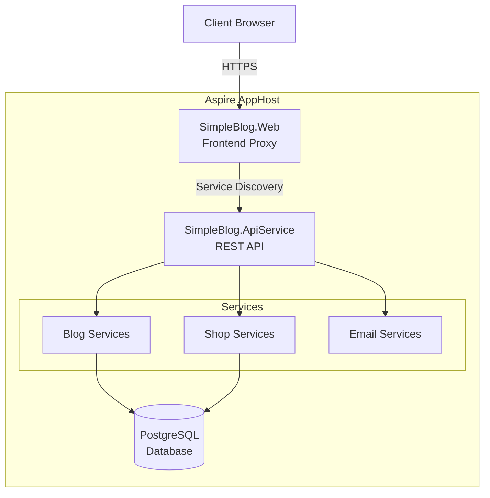

# Technical Documentation

> **For:** Architects, Senior Developers, Technical Leads  
> **Purpose:** Detailed architecture and technical decisions documentation

---

## 📚 Table of Contents

### System Architecture
- [architecture-overview.md](./architecture-overview.md) - Application architecture overview
- [service-architecture.md](./service-architecture.md) - Microservices architecture
- [data-flow.md](./data-flow.md) - Data flow in the system
- [aspire-architecture.md](./aspire-architecture.md) - .NET Aspire architecture

### Observability and Monitoring
- [logging-observability.md](./logging-observability.md) - Structured logging and OpenTelemetry

### External Services
- [cloudinary-integration.md](./cloudinary-integration.md) - Cloudinary image storage integration

### Technologies and Stack
- [technology-stack.md](./technology-stack.md) - Complete technology stack
- [dependencies.md](./dependencies.md) - Dependencies and library versions
- [third-party-services.md](./third-party-services.md) - External services

### Design Patterns
- [design-patterns.md](./design-patterns.md) - Used design patterns
- [repository-pattern.md](./repository-pattern.md) - Repository pattern implementation
- [specification-pattern.md](./specification-pattern.md) - Specification pattern for queries

### Database
- [database-schema.md](./database-schema.md) - Database schema
- [entity-relationships.md](./entity-relationships.md) - Relationships between entities
- [ef-core-configuration.md](./ef-core-configuration.md) - EF Core configuration
- [entity-framework-migrations.md](./entity-framework-migrations.md) - EF Core migrations management and troubleshooting

### API Design
- [api-specification.md](./api-specification.md) - API endpoints specification
- [authentication-flow.md](./authentication-flow.md) - JWT authentication flow
- [error-handling.md](./error-handling.md) - Error handling and responses
- [image-upload-tags-api.md](./image-upload-tags-api.md) - Multi-image upload and tag system API guide

### Security
- [security-architecture.md](./security-architecture.md) - Security architecture
- [jwt-implementation.md](./jwt-implementation.md) - JWT implementation
- [data-protection.md](./data-protection.md) - User data protection

### Performance
- [performance-considerations.md](./performance-considerations.md) - Performance considerations
- [caching-strategy.md](./caching-strategy.md) - Caching strategy
- [database-optimization.md](./database-optimization.md) - DB query optimization

### Monitoring and Observability
- [logging-architecture.md](./logging-architecture.md) - Logging architecture
- [telemetry.md](./telemetry.md) - Telemetry and distributed tracing
- [metrics.md](./metrics.md) - Application metrics

### Architecture Decision Records (ADR)
- [adr-001-aspire-adoption.md](./adr-001-aspire-adoption.md) - .NET Aspire choice
- [adr-002-postgresql.md](./adr-002-postgresql.md) - PostgreSQL as database
- [adr-003-repository-pattern.md](./adr-003-repository-pattern.md) - Repository pattern
- [adr-004-jwt-auth.md](./adr-004-jwt-auth.md) - JWT for authentication

---

## 🏗️ High-Level Architecture

---

## 🎯 Key Technical Decisions

### Why .NET Aspire?
- Local service orchestration
- Service discovery out-of-the-box
- Built-in observability and telemetry
- Simplified configuration management

### Why PostgreSQL?
- Open source, mature technology
- Excellent integration with EF Core
- Advanced data types support
- Production reliability

### Why Repository Pattern?
- Data access logic separation
- Easier testing (mocking)
- Abstraction over EF Core
- Implementation swap capability

### Why Specification Pattern?
- Reusable query logic
- Testable business conditions
- Query composition
- Single Responsibility Principle

---

## 🔧 Technology Stack

### Backend
- **.NET 9.0** - Framework
- **ASP.NET Core** - Web framework
- **.NET Aspire 13.1.0** - Orchestration
- **Entity Framework Core 9.0.10** - ORM
- **FluentValidation** - Validation
- **JWT Bearer** - Authentication

### Database
- **PostgreSQL** - Primary database
- **Npgsql 9.0.4** - .NET provider
- **EF Core Migrations** - Schema management

### Frontend
- **React 18** - UI framework
- **Vite** - Build tool and dev server
- **React Router** - Routing

### Infrastructure
- **Docker** - Containerization
- **Aspire Dashboard** - Local orchestration
- **Render/Azure** - Cloud hosting

---

## 📊 Metrics and Goals

| Metric | Target | Current |
|--------|--------|---------|
| Response time (p95) | < 200ms | TBD |
| Availability | 99.5% | TBD |
| Test coverage | > 80% | ~60% |
| Build time | < 5min | ~3min |

---

## 🔍 Development Areas

- [ ] Caching implementation (Redis)
- [ ] API rate limiting
- [ ] Background jobs (Hangfire/Quartz)
- [ ] Full-text search (PostgreSQL FTS)
- [ ] API versioning
- [ ] OpenAPI/Swagger documentation
- [ ] Message queue (RabbitMQ/Azure Service Bus)

---

## 📖 Useful Links

- [Development documentation](../development/README.md)
- [Deployment documentation](../deployment/README.md)
- [.NET Architecture guides](https://learn.microsoft.com/dotnet/architecture/)
- [Microsoft Azure Well-Architected Framework](https://learn.microsoft.com/azure/well-architected/)
