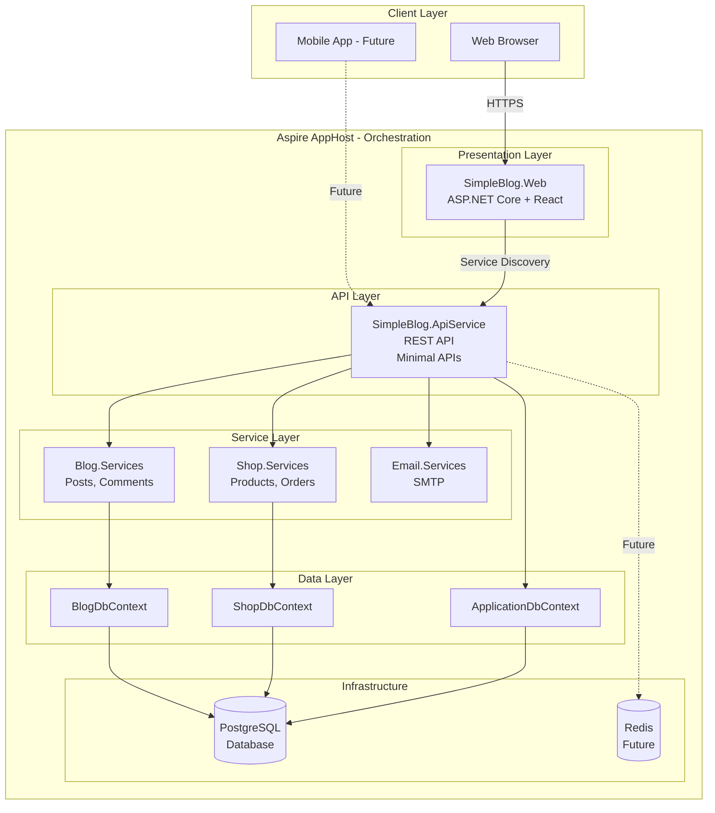
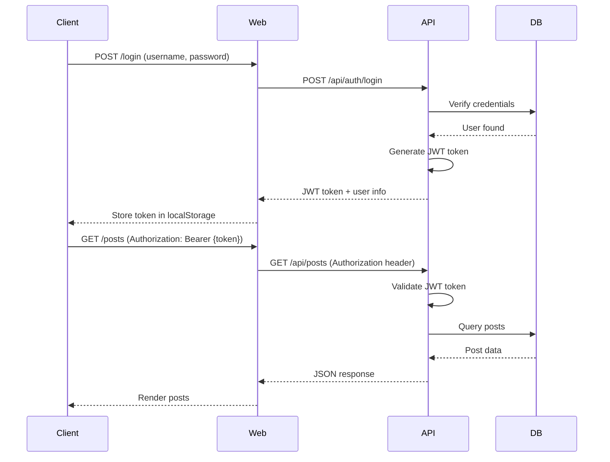
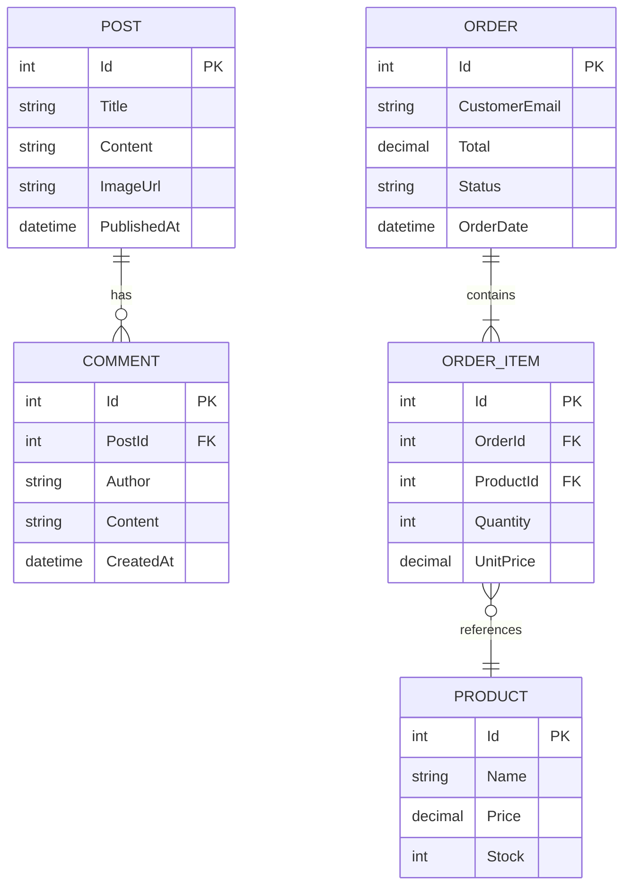

# architecture overview

> ## metadane dokumentu
> 
> ### ✅ wymagane
> **Tytuł:** Architecture Overview  
> **Opis:** Kompleksowy przegląd architektury SimpleBlog - od warstw aplikacji przez komponenty systemu po decyzje architektoniczne  
> **Audience:** architect, developer  
> **Topic:** technical  
> **Last Update:** 2026-01-17
>
> ### 📌 rekomendowane
> **Parent Document:** [README.md](./README.md)  
> **Difficulty:** advanced  
> **Estimated Time:** 45 min  
> **Version:** 1.0.0  
> **Status:** approved
>
> ### 🏷️ opcjonalne
> **Prerequisites:** Znajomość .NET, Clean Architecture, Domain-Driven Design basics  
> **Related Docs:** [design-patterns.md](./design-patterns.md), [database-schema.md](./database-schema.md)  
> **Tags:** `architecture`, `design`, `aspire`, `microservices`, `clean-architecture`

---

## 📋 przegląd

SimpleBlog wykorzystuje architekturę mikroserwisów orkiestrowaną przez .NET Aspire z wyraźnym podziałem na warstwy i domeny biznesowe.

---

## 🏗️ architektura wysokiego poziomu



---

## 🎯 kluczowe decyzje architektoniczne

### clean architecture principles

SimpleBlog implementuje zasady Clean Architecture:

1. **Dependency Inversion:** Zależności wskazują do wewnątrz (domain → infrastructure)
2. **Separation of Concerns:** Jasny podział odpowiedzialności między warstwa
3. **Independence:** Core business logic niezależny od frameworków
4. **Testability:** Każda warstwa testowalana w izolacji

### warstwy aplikacji

```
┌─────────────────────────────────────────┐
│  Presentation Layer (Web, API)          │  ← Controllers, Endpoints, UI
├─────────────────────────────────────────┤
│  Application Layer (Services)           │  ← Business Logic, Use Cases
├─────────────────────────────────────────┤
│  Domain Layer (Common, Models)          │  ← Entities, Interfaces, DTOs
├─────────────────────────────────────────┤
│  Infrastructure Layer (*.Services)      │  ← EF Core, Email, External APIs
└─────────────────────────────────────────┘
```

---

## 🔧 komponenty systemu

### 1. aspire apphost (orchestrator)

**Odpowiedzialność:**
- Zarządzanie cyklem życia serwisów
- Service discovery między komponentami
- Konfiguracja shared dependencies (PostgreSQL)
- Monitoring i observability

**Kluczowe koncepcje:**
```csharp
// Service discovery - automatyczne URL injection
var api = builder.AddProject<Projects.SimpleBlog_ApiService>("apiservice");
var web = builder.AddProject<Projects.SimpleBlog_Web>("webfrontend")
    .WithReference(api);  // Web zna URL do API

// Infrastructure orchestration
var postgres = builder.AddPostgres("postgres")
    .WithDataVolume();  // Persistent storage
```

**Zalety:**
- Zero konfiguracji connection stringów w dev
- Automatyczne health checks
- Unified dashboard dla wszystkich serwisów
- Built-in distributed tracing

---

### 2. api service (backend)

**Architektura:** Minimal APIs + Repository Pattern

```csharp
// Endpoint definition
app.MapGet("/api/posts", async (IPostRepository repo) =>
{
    var posts = await repo.GetAllAsync();
    return Results.Ok(posts);
});

// Service registration
builder.Services.AddScoped<IPostRepository, EfPostRepository>();
```

**Design patterns:**
- **Repository Pattern:** Abstrakcja dostępu do danych
- **Specification Pattern:** Reużywalne query logic
- **Dependency Injection:** Loose coupling między warstwami
- **DTOs:** Separacja domain models od API contracts

**Struktura endpointów:**
```
/api
├── /auth
│   ├── POST /login
│   └── POST /register
├── /posts
│   ├── GET /
│   ├── GET /{id}
│   ├── POST /
│   ├── PUT /{id}
│   └── DELETE /{id}
├── /products
│   └── ...
└── /orders
    └── ...
```

---

### 3. web frontend

**Architektura:** ASP.NET Core Backend + React SPA

```
SimpleBlog.Web
├── Program.cs              ← ASP.NET Core proxy/host
└── client/                 ← React aplikacja
    ├── src/
    │   ├── components/     ← React components
    │   ├── hooks/          ← Custom hooks (useAuth, usePosts)
    │   ├── services/       ← API client
    │   └── types/          ← TypeScript definitions
    └── vite.config.ts      ← Build configuration
```

**Komunikacja:**
```typescript
// API service with service discovery
const API_URL = import.meta.env.VITE_API_URL || '/api';

export const getPosts = async (): Promise<Post[]> => {
  const response = await fetch(`${API_URL}/posts`);
  return response.json();
};
```

**Wzorce:**
- **Custom Hooks:** Encapsulation of business logic
- **Context API:** Global state (auth)
- **Component Composition:** Reużywalne UI components

---

### 4. domain services

Każda domena ma swój własny DbContext i zestaw repozytoriów.

#### blog domain

```csharp
public class BlogDbContext : DbContext
{
    public DbSet<Post> Posts { get; set; }
    public DbSet<Comment> Comments { get; set; }
}

public class EfPostRepository : IPostRepository
{
    public async Task<IEnumerable<Post>> GetAllAsync()
    {
        return await _context.Posts
            .Include(p => p.Comments)
            .ToListAsync();
    }
}
```

**Encje:**
- `Post` - Blog post (title, content, image, publishedAt)
- `Comment` - User comments on posts
- `AboutMe` - Static about page content

#### shop domain

```csharp
public class ShopDbContext : DbContext
{
    public DbSet<Product> Products { get; set; }
    public DbSet<Order> Orders { get; set; }
    public DbSet<OrderItem> OrderItems { get; set; }
}
```

**Encje:**
- `Product` - Shop product (name, price, stock)
- `Order` - Customer order (status, total, items)
- `OrderItem` - Line items in order

---

## 🔐 security architecture

### authentication flow



**JWT Configuration:**
```csharp
builder.Services.AddAuthentication(JwtBearerDefaults.AuthenticationScheme)
    .AddJwtBearer(options =>
    {
        options.TokenValidationParameters = new TokenValidationParameters
        {
            ValidateIssuer = true,
            ValidateAudience = true,
            ValidateLifetime = true,
            ValidateIssuerSigningKey = true,
            ValidIssuer = jwtIssuer,
            ValidAudience = jwtAudience,
            IssuerSigningKey = new SymmetricSecurityKey(
                Encoding.UTF8.GetBytes(jwtKey))
        };
    });
```

**Token expiration:** 60 minut (konfigurowalne)

---

## 📊 data architecture

### database schema strategy

SimpleBlog używa **Multi-Context Pattern** z trzema oddzielnymi DbContext:

```
PostgreSQL Database (blogdb)
├── dbo.Posts                    ← BlogDbContext
├── dbo.Comments                 ← BlogDbContext
├── dbo.AboutMe                  ← BlogDbContext
├── dbo.Products                 ← ShopDbContext
├── dbo.Orders                   ← ShopDbContext
├── dbo.OrderItems               ← ShopDbContext
├── dbo.AspNetUsers              ← ApplicationDbContext
└── dbo.AspNetRoles              ← ApplicationDbContext
```

**Zalety multi-context:**
- ✅ Separacja domen (Bounded Contexts z DDD)
- ✅ Niezależne migracje per domain
- ✅ Łatwiejsze testowanie (mock pojedynczego context)
- ✅ Potencjalna migracja do osobnych baz danych

**Entity relationships:**


---

## 🚀 deployment architecture

### local development

```
Docker Desktop
├── PostgreSQL Container (Aspire managed)
│   └── Port: Dynamic (service discovery)
└── pgAdmin Container (docker-compose)
    └── Port: 5050

.NET Aspire Dashboard
├── webfrontend (https://localhost:7xxx)
├── apiservice (https://localhost:5xxx)
└── postgres (connection info)
```

### production (render)

```
Render Platform
├── simpleblog-db (PostgreSQL Managed)
│   ├── Daily backups
│   └── Connection pooling
├── simpleblog-api (Web Service)
│   ├── Docker container
│   ├── Health checks: /health
│   └── Auto-deploy from main branch
└── simpleblog-web (Web Service)
    ├── Docker container
    ├── Proxies to API
    └── Serves React SPA
```

**Service communication:** Environment variables with service URLs

---

## 📈 scalability considerations

### horizontal scaling

```
Load Balancer
├── Web Instance 1  ──┐
├── Web Instance 2  ──┼──> API Instance 1  ──┐
└── Web Instance 3  ──┘    API Instance 2  ──┼──> PostgreSQL
                                              └──> Redis (Future)
```

**Current limitations:**
- ❌ No caching layer (wszystkie requesty do DB)
- ❌ No message queue (synchroniczne operacje)
- ❌ Session state w JWT (stateless, ale duże tokeny)

**Planned improvements:**
- ✅ Redis dla cachowania queries
- ✅ Background job processing (Hangfire)
- ✅ CDN dla statycznych assetów
- ✅ Database read replicas

---

## 🔍 observability architecture

### logging

```
Application
├── Structured Logging (Serilog)
│   ├── Console (Development)
│   ├── File (Production)
│   └── Seq/Application Insights (Future)
│
└── Request Correlation
    └── X-Correlation-Id header
```

**Middleware:** `RequestLoggingMiddleware` dodaje correlation ID i timing do każdego requestu

### distributed tracing

```
Aspire Dashboard
├── Traces per request
├── Service-to-service calls
└── Database query timing
```

**OpenTelemetry:** Automatycznie instrumentowane przez Aspire

### metrics

```
Aspire Dashboard Metrics
├── HTTP request rate
├── Response time (p50, p95, p99)
├── Error rate
└── Database connection pool
```

---

## 🔗 powiązane dokumenty

- [design-patterns.md](./design-patterns.md) - Wykorzystane wzorce
- [database-schema.md](./database-schema.md) - Szczegóły schematu DB
- [api-specification.md](./api-specification.md) - API endpoints
- [security-architecture.md](./security-architecture.md) - Security details

---

## 📝 architecture decision records

- [adr-001-aspire-adoption.md](./adr-001-aspire-adoption.md) - Wybór .NET Aspire
- [adr-002-postgresql.md](./adr-002-postgresql.md) - PostgreSQL vs inne bazy
- [adr-003-repository-pattern.md](./adr-003-repository-pattern.md) - Repository pattern
- [adr-004-jwt-auth.md](./adr-004-jwt-auth.md) - JWT authentication

---

## 💡 key takeaways

> **Modularity:** Każda domena ma własny context i serwisy

> **Testability:** Repository pattern umożliwia łatwe mockowanie

> **Scalability:** Stateless API gotowe do horizontal scaling

> **Maintainability:** Clear separation of concerns, SOLID principles

> **Observability:** Built-in logging, tracing i metrics przez Aspire
