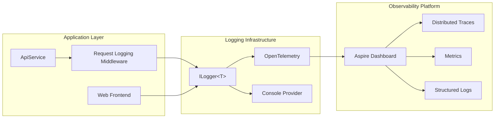

# Logging and Observability

> ## metadane dokumentu
> 
> ### ✅ wymagane
> **Tytuł:** Logging and Observability  
> **Opis:** Kompleksowy przewodnik po strukturalnym logowaniu, OpenTelemetry i obserwacji w SimpleBlog  
> **Audience:** developer, devops  
> **Topic:** technical  
> **Last Update:** 2026-01-17
>
> ### 📌 rekomendowane
> **Parent Document:** [README.md](./README.md)  
> **Difficulty:** intermediate  
> **Estimated Time:** 30 min  
> **Version:** 1.0.0  
> **Status:** approved
>
> ### 🏷️ opcjonalne
> **Prerequisites:** Podstawowa znajomość .NET, HTTP APIs  
> **Related Docs:** [architecture-overview.md](./architecture-overview.md)  
> **Tags:** `logging`, `observability`, `opentelemetry`, `aspire`, `monitoring`

---

## 📋 przegląd

SimpleBlog wykorzystuje strukturalne logowanie z `ILogger<T>` oraz OpenTelemetry dla kompleksowej obserwacji systemu. Wszystkie serwisy są zintegrowane z .NET Aspire Dashboard dla centralizacji logów, metryk i trace'ów.

---

## 🎯 architektura logowania



---

## 🔧 konfiguracja

### ServiceDefaults Integration

Wszystkie serwisy dziedziczą domyślną konfigurację przez `ServiceDefaults`:

```csharp
// SimpleBlog.ServiceDefaults/Extensions.cs
public static IHostApplicationBuilder AddServiceDefaults(this IHostApplicationBuilder builder)
{
    builder.ConfigureOpenTelemetry();
    
    builder.Services.AddServiceDiscovery();
    builder.Services.ConfigureHttpClientDefaults(http =>
    {
        http.AddStandardResilienceHandler();
        http.AddServiceDiscovery();
    });

    builder.Services.AddHealthChecks()
        .AddCheck("self", () => HealthCheckResult.Healthy(), ["live"]);

    return builder;
}
```

### OpenTelemetry Setup

```csharp
private static IHostApplicationBuilder ConfigureOpenTelemetry(this IHostApplicationBuilder builder)
{
    builder.Logging.AddOpenTelemetry(logging =>
    {
        logging.IncludeFormattedMessage = true;
        logging.IncludeScopes = true;
    });

    builder.Services.AddOpenTelemetry()
        .WithMetrics(metrics =>
        {
            metrics.AddAspNetCoreInstrumentation()
                .AddHttpClientInstrumentation()
                .AddRuntimeInstrumentation();
        })
        .WithTracing(tracing =>
        {
            tracing.AddAspNetCoreInstrumentation()
                .AddHttpClientInstrumentation();
        });

    builder.AddOpenTelemetryExporters();

    return builder;
}
```

---

## 📝 strukturalne logowanie

### Podstawowe zasady

**✅ Dobre praktyki:**
```csharp
// Strukturalne parametry
logger.LogInformation("User {UserId} created post {PostId}", userId, postId);

// Scope dla kontekstu
using (logger.BeginScope(new Dictionary<string, object>
{
    ["CorrelationId"] = correlationId,
    ["UserId"] = userId
}))
{
    logger.LogInformation("Processing order");
}

// Exception logging
logger.LogError(exception, "Failed to upload image for user {UserId}", userId);
```

**❌ Unikaj:**
```csharp
// String interpolation - nie może być indeksowane
logger.LogInformation($"User {userId} created post {postId}");

// Console.WriteLine - nie integruje się z telemetrią
Console.WriteLine("Processing request");

// Zbyt ogólne komunikaty
logger.LogError("Error occurred");
```

### Log Levels

| Level | Zastosowanie | Przykład |
|-------|-------------|----------|
| `Trace` | Szczegółowe debugowanie | `"Entering method GetUserById with id {UserId}"` |
| `Debug` | Informacje deweloperskie | `"Query returned {Count} results"` |
| `Information` | Normalne działanie systemu | `"User {UserId} successfully logged in"` |
| `Warning` | Nieprawidłowe sytuacje bez błędu | `"Cloudinary not configured. Image uploads disabled"` |
| `Error` | Błędy wymagające uwagi | `"Failed to save post {PostId}: {Error}"` |
| `Critical` | Błędy krytyczne | `"Database connection lost"` |

---

## 🔍 request logging middleware

### Implementacja

```csharp
// SimpleBlog.ApiService/Middleware/RequestLoggingMiddleware.cs
public sealed class RequestLoggingMiddleware(RequestDelegate next, ILogger<RequestLoggingMiddleware> logger)
{
    public async Task InvokeAsync(HttpContext context)
    {
        var correlationId = context.TraceIdentifier;
        var startTime = DateTime.UtcNow;

        using (logger.BeginScope(new Dictionary<string, object>
        {
            ["CorrelationId"] = correlationId,
            ["RequestPath"] = context.Request.Path,
            ["RequestMethod"] = context.Request.Method
        }))
        {
            try
            {
                await next(context);
            }
            finally
            {
                var duration = DateTime.UtcNow - startTime;
                logger.LogInformation(
                    "HTTP {Method} {Path} responded {StatusCode} in {Duration}ms. CorrelationId: {CorrelationId}",
                    context.Request.Method,
                    context.Request.Path,
                    context.Response.StatusCode,
                    duration.TotalMilliseconds,
                    correlationId);
            }
        }
    }
}
```

### Rejestracja

```csharp
// SimpleBlog.ApiService/Program.cs
app.UseMiddleware<RequestLoggingMiddleware>();
```

### Output przykładowy

```
info: SimpleBlog.ApiService.Middleware.RequestLoggingMiddleware[0]
      HTTP POST /posts responded 201 in 45ms. CorrelationId: 0HNIM0MF2C6JQ:00000003
```

---

## 📊 przykłady logowania w różnych warstwach

### Endpoints

```csharp
// SimpleBlog.ApiService/Endpoints/SiteSettingsEndpoints.cs
public static async Task<IResult> UploadLogo(
    IFormFile file,
    ISiteSettingsRepository repository,
    IImageStorageService imageStorage,
    HttpContext context,
    ILogger<Program> logger,
    CancellationToken ct)
{
    logger.LogInformation("Starting logo upload. Filename: {FileName}, Size: {Size} bytes", 
        file.FileName, file.Length);
    
    try
    {
        var imageUrl = await imageStorage.UploadImageAsync(stream, file.FileName, "logos", ct);
        logger.LogInformation("Logo uploaded successfully to {ImageUrl}", imageUrl);
        
        return Results.Ok(settings);
    }
    catch (Exception ex)
    {
        logger.LogError(ex, "Error uploading logo");
        return Results.Problem("Failed to upload logo");
    }
}
```

### Services

```csharp
// SimpleBlog.ApiService/Services/CloudinaryStorageService.cs
public async Task<string> UploadImageAsync(
    Stream stream, 
    string fileName, 
    string folder, 
    CancellationToken cancellationToken)
{
    _logger.LogDebug("Uploading image {FileName} to folder {Folder}", fileName, folder);
    
    var uploadParams = new ImageUploadParams
    {
        File = new FileDescription(fileName, stream),
        Folder = $"simpleblog/{folder}",
        UniqueFilename = true
    };

    var uploadResult = await _cloudinary.UploadAsync(uploadParams, cancellationToken);

    if (uploadResult.StatusCode != System.Net.HttpStatusCode.OK)
    {
        _logger.LogError("Cloudinary upload failed: {Error}", uploadResult.Error?.Message);
        throw new InvalidOperationException($"Image upload failed: {uploadResult.Error?.Message}");
    }

    _logger.LogInformation("Image uploaded successfully. PublicId: {PublicId}, URL: {Url}", 
        uploadResult.PublicId, uploadResult.SecureUrl);
    
    return uploadResult.SecureUrl.ToString();
}
```

### Configuration

```csharp
// SimpleBlog.ApiService/Program.cs
var logger = builder.Services.BuildServiceProvider().GetRequiredService<ILogger<Program>>();

if (!string.IsNullOrEmpty(cloudinaryUrl))
{
    cloudinary = new Cloudinary(cloudinaryUrl);
    cloudinary.Api.Secure = true;
    logger.LogInformation("Cloudinary configured from CLOUDINARY_URL");
}
else
{
    logger.LogWarning("Cloudinary not configured. Image upload features will not be available. " +
        "Set CLOUDINARY_URL environment variable");
}
```

---

## 🎨 correlation ids

### Automatyczne generowanie

ASP.NET Core automatycznie generuje `TraceIdentifier` dla każdego requesta:

```csharp
var correlationId = context.TraceIdentifier; // np. "0HNIM0MF2C6JQ:00000003"
```

### Propagacja przez API

```csharp
// SimpleBlog.Web/ApiProxyHelper.cs
private static void ForwardAuthorizationHeader(HttpContext? context, HttpRequestMessage request)
{
    if (context is not null)
    {
        // Propaguj correlation ID
        request.Headers.Add("X-Correlation-ID", context.TraceIdentifier);
        
        if (context.Request.Headers.TryGetValue("Authorization", out var authHeader))
        {
            request.Headers.Add("Authorization", authHeader[0]!);
        }
    }
}
```

---

## 📈 metryki

### Dostępne metryki

SimpleBlog automatycznie zbiera:

- **HTTP Metrics**: Request count, duration, status codes
- **Runtime Metrics**: GC collections, thread pool usage, memory
- **Custom Metrics**: Upload count, database query duration (future)

### Przykład custom metrics

```csharp
public class MetricsService
{
    private readonly Counter<int> _uploadCounter;
    
    public MetricsService(IMeterFactory meterFactory)
    {
        var meter = meterFactory.Create("SimpleBlog.Uploads");
        _uploadCounter = meter.CreateCounter<int>("uploads.count");
    }
    
    public void RecordUpload(string type)
    {
        _uploadCounter.Add(1, new KeyValuePair<string, object?>("type", type));
    }
}
```

---

## 🔗 distributed tracing

### Automatyczne instrumentowanie

OpenTelemetry automatycznie tworzy trace spans dla:
- HTTP requests (incoming i outgoing)
- Database queries (EF Core)
- Custom operations (przez Activity API)

### Custom spans

```csharp
using var activity = ActivitySource.StartActivity("ProcessOrder");
activity?.SetTag("order.id", orderId);
activity?.SetTag("user.id", userId);

try
{
    await ProcessOrderInternal(orderId);
    activity?.SetTag("order.status", "completed");
}
catch (Exception ex)
{
    activity?.SetStatus(ActivityStatusCode.Error, ex.Message);
    throw;
}
```

---

## 🖥️ aspire dashboard

### Dostęp

Development: https://localhost:17185 (lub port wskazany przy starcie AppHost)

### Funkcje

- **Logs**: Filtrowanie po serwisie, poziomie, czasie
- **Traces**: Wizualizacja distributed traces, waterfall view
- **Metrics**: Wykresy metryk w czasie rzeczywistym
- **Resources**: Status serwisów, health checks
- **Console Output**: Output każdego serwisu z kolorowaniem

---

## 🔧 konfiguracja poziomów logowania

### appsettings.json

```json
{
  "Logging": {
    "LogLevel": {
      "Default": "Information",
      "Microsoft.AspNetCore": "Warning",
      "Microsoft.EntityFrameworkCore": "Information",
      "SimpleBlog": "Debug"
    }
  }
}
```

### Zmienne środowiskowe

```powershell
# Globalny poziom
$ENV:Logging__LogLevel__Default = "Debug"

# Dla konkretnego namespace
$ENV:Logging__LogLevel__SimpleBlog.ApiService = "Trace"
```

---

## 🚀 produkcja

### Eksport do zewnętrznych systemów

```csharp
// Dodaj exportery dla produkcji
builder.Services.AddOpenTelemetry()
    .UseOtlpExporter(); // OTLP endpoint (Jaeger, Grafana Tempo)

// Lub specyficzne exportery
builder.Services.AddOpenTelemetry()
    .WithTracing(tracing => tracing.AddJaegerExporter())
    .WithMetrics(metrics => metrics.AddPrometheusExporter());
```

### Popularne backendy

- **Jaeger**: Distributed tracing
- **Prometheus + Grafana**: Metrics i dashboards
- **Seq**: Strukturalne logi .NET
- **Application Insights**: Azure-native observability
- **Elastic Stack**: Logs, metrics, traces

---

## 🎯 best practices

### ✅ Zalecane

1. **Używaj strukturalnych parametrów** zamiast interpolacji stringów
2. **Zawsze loguj wyjątki** z pełnym stack trace
3. **Dodawaj kontekst** przez BeginScope
4. **Używaj odpowiednich poziomów** - nie wszystko to Information
5. **Loguj metric znaczące** - nie każde wywołanie metody
6. **Unikaj PII (Personally Identifiable Information)** w logach
7. **Używaj CorrelationId** dla rozproszonego trackingu

### ❌ Unikaj

1. **Console.WriteLine** - używaj ILogger
2. **String interpolation** - używaj strukturalnych parametrów
3. **Zbyt szczegółowych logów** na Production (Trace/Debug)
4. **Logowania haseł, tokenów, secrets**
5. **Try-catch z pustym blokiem catch**
6. **Synchronicznego I/O** w middleware logowania

---

## 📚 przykłady zapytań w dashboard

### Znajdź wszystkie błędy w ostatniej godzinie
```
Level == "Error" && Timestamp > @now - 1h
```

### Trace dla konkretnego użytkownika
```
UserId == "123e4567-e89b-12d3-a456-426614174000"
```

### Slow requests (>1s)
```
Duration > 1000 && RequestPath startsWith "/api/"
```

---

## 🔄 integracja z CI/CD

### GitHub Actions

```yaml
- name: Run with logging
  run: dotnet test --logger "trx;LogFileName=test-results.trx"
  
- name: Upload logs
  if: failure()
  uses: actions/upload-artifact@v3
  with:
    name: logs
    path: |
      **/logs/*.log
      **/test-results.trx
```

---

## 📖 dodatkowe zasoby

- [OpenTelemetry .NET Documentation](https://opentelemetry.io/docs/instrumentation/net/)
- [.NET Aspire Observability](https://learn.microsoft.com/en-us/dotnet/aspire/fundamentals/telemetry)
- [ILogger Best Practices](https://learn.microsoft.com/en-us/dotnet/core/extensions/logging)
- [Structured Logging with Serilog](https://github.com/serilog/serilog/wiki/Structured-Data)

---

## 🆘 troubleshooting

### Logi nie pojawiają się w Dashboard

1. Sprawdź czy `AddServiceDefaults()` jest wywołane
2. Zweryfikuj konfigurację logowania w appsettings.json
3. Sprawdź czy Aspire Dashboard jest uruchomiony

### Brak trace'ów między serwisami

1. Upewnij się, że correlation ID jest propagowany w headerach
2. Sprawdź czy `AddServiceDiscovery()` jest skonfigurowane
3. Zweryfikuj że HttpClient używa instrumentacji OpenTelemetry

### Za dużo logów

1. Zwiększ minimum poziom w appsettings.json
2. Wyłącz verbose logging dla Microsoft.*
3. Użyj filtrów w Dashboard do ukrycia nieistotnych logów
